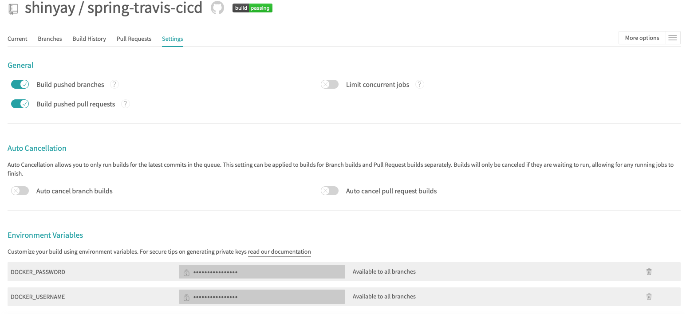

# Travis CI with Spring Boot using Jacoco and CodeCov

Continuous Integration / Continuous Delivery for Spring Boot

## Description

- [Travis CI Dashboard](https://travis-ci.com/github/shinyay/spring-travis-cicd)

## Demo

### 1. Building Process in Travis CI

- `.travis.yml` is located at repository;s root

```yaml
language: java
jdk:
  - openjdk11
script:
  - ./gradlew clean build
```

### 2. Jib plugin to build Container

- Add Jib Plugin

```kotlin
plugins {
	id("com.google.cloud.tools.jib") version "2.4.0"
}
```

- Add Jib Configuration

```kotlin
jib {
	from {
		image = "openjdk:11-slim"
	}
	to {
		image = "registry.hub.docker.com/shinyay/${project.name}"
		tags = setOf("latest", "${project.version}")
	}
	container {
		creationTime = "USE_CURRENT_TIMESTAMP"
	}
}
```

### 3. Container Building Process in Travis CI

Travis CI is a hosted Continuous Integration Service.

- [Travis CI Build History](https://travis-ci.com/github/shinyay/spring-travis-cicd/builds)

```yaml
language: java
jdk:
  - openjdk11
services:
  - docker

before_install:
  - echo "$DOCKER_PASSWORD" | docker login -u "$DOCKER_USERNAME" --password-stdin

script:
  - ./gradlew clean build
  - ./gradlew jib
```

### 4. Travis Settings for Docker Credential

- [Travis Settings](https://travis-ci.com/github/shinyay/spring-travis-cicd/settings)

#### Environment Variables

- `DOCKER_USERNAME`
- `DOCKER_PASSWORD`



### 5. Code Analysis

Analyze code using Jacoco and CodeCov.

- Jacoco is coder coverage library.
- CodeCov will inform test coverage.

  - [CodeCov](https://codecov.io/gh/shinyay/spring-travis-cicd)

#### Jacoco Report Configuration

Add the following configuration to build.gradle

```kotlin
tasks.test {
	finalizedBy(tasks.jacocoTestReport)
}
tasks.jacocoTestReport {
	reports {
		xml.isEnabled = true
		html.isEnabled = true
	}
	dependsOn(tasks.test)
}
```

#### CodeCov and Jacoco Integration

Add the following configuration to travis.yml

```yaml
after_success:
  - bash <(curl -s https://codecov.io/bash)
```

## Features

- feature:1
- feature:2

## Requirement

## Usage

## Installation

## Licence

Released under the [MIT license](https://gist.githubusercontent.com/shinyay/56e54ee4c0e22db8211e05e70a63247e/raw/34c6fdd50d54aa8e23560c296424aeb61599aa71/LICENSE)

## Author

[shinyay](https://github.com/shinyay)
